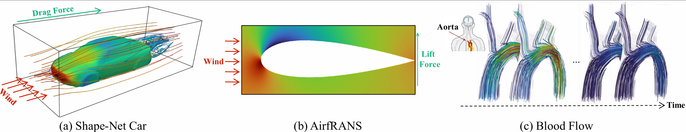

# The official code repository of SpiderSolver

# SpiderSolver: A Geometry-Aware Transformer for Solving PDEs on Complex Geometries，NeurIPS 2025. 
[Paper](chrome-extension://efaidnbmnnnibpcajpcglclefindmkaj/https://openreview.net/pdf/054dcb68b120d4b02b356ca2f357ae4fbd463354.pdf)
[Slides](chrome-extension://efaidnbmnnnibpcajpcglclefindmkaj/https://neurips.cc/media/neurips-2025/Slides/116641.pdf)
[Poster](https://neurips.cc/media/PosterPDFs/NeurIPS%202025/116641.png?t=1761011039.1089365)

##  🧾 1.  Abstract
 Transformers have demonstrated effectiveness in solving partial differential equations (PDEs). However, extending them to solve PDEs on complex geometries
 remains a challenge. In this work, we propose SpiderSolver, a geometry-aware transformer that introduces spiderweb tokenization for handling complex domain
 geometry and irregularly discretized points. Our method partitions the irregular spatial domain into spiderweb-like patches, guided by the domain boundary geometry. SpiderSolver leverages a coarse-grained attention mechanism to capture global interactions across spiderweb tokens and a fine-grained attention mechanism
 to refine feature interactions between the domain boundary and its neighboring interior points. We evaluate SpiderSolver on PDEs with diverse domain geometries
 across five datasets, including cars, airfoils, blood flow in the human thoracic aorta, as well as canonical cases governed by the Navier-Stokes, Darcy flow, elasticity, and plasticity equations.
 Experimental results demonstrate that SpiderSolver consistently achieves state-of-the-art performance across different datasets and metrics, with better generalization
 ability in the OOD setting.


## 🧠 2.  Method

The three figures respectively show: visualization of partial datasets, the model’s overall architecture, and the spiderweb-like subregion structure generated by spiderweb tokenization along with the optimal transport–based alignment for spectral clustering.




##  🏋️‍♂️ 3.  Training and Evaluation

### 🔧 Training

After downloading the corresponding dataset, change the corresponding data path in the code.

```
CUDA_VISIBLE_DEVICES=0 python ShapeNetCar/main_SpiderSolver_ShapeNetCar.py --n_clusters 6 --onion_num 10 --nb_epochs 200;
CUDA_VISIBLE_DEVICES=0 python AirfRANS/main_SpiderSolver_Airfoil.py --n_clusters 4 --onion_num 5  --nb_epochs 398;
CUDA_VISIBLE_DEVICES=0 python BloodFlow/main_SpiderSolver_BloodFlow.py --n_clusters 6 --onion_num 5 --epochs 500 --width 512  --batch_size 10;
```


### 🧪 Evaluation
The weights of our model are available for download at [Google Drive](https://drive.google.com/drive/folders/13MhUPS-Oyygm2JXEhbEuhz5drmUiabXR?usp=sharing)
or [Baidu Netdisk](https://pan.baidu.com/s/1xwKLpwQdGL2vFqSFt-sQFA?pwd=4xpi).

```
CUDA_VISIBLE_DEVICES=0 python ShapeNetCar/main_evaluation.py;
CUDA_VISIBLE_DEVICES=0 python AirfRANS/main_evaluation.py;
CUDA_VISIBLE_DEVICES=0 python BloodFlow/main_evaluation.py;
```


## 🛠️ 5. Requirements
The required Python packages for each code implementation are listed in their respective `requirements.txt` files.


## 📚 6. Citation
If you find this work helpful for your research, please cite our paper:
```
@inproceedings{qi2025SpiderSolver,
  title     = {SpiderSolver: A Geometry-Aware Transformer for Solving PDEs on Complex Geometries},
  author    = {Kai Qi, Fan Wang, Zhewen Dong and Jian Sun},
  booktitle = {NeurIPS},
  year      = {2025}
}
```


## 🙏 7. Acknowledgement

We would like to acknowledge the contributions of the following works, which inspired and supported our research:

- Haixu Wu, Huakun Luo, et al. **Transolver: A fast transformer solver for pdes on general geometries**. *ICML*, 2024.
- Zongyi Li, Nikola Kovachki, et al. **Fourier neural operator for parametric partial differential equations**. *ICLR* 2021.


