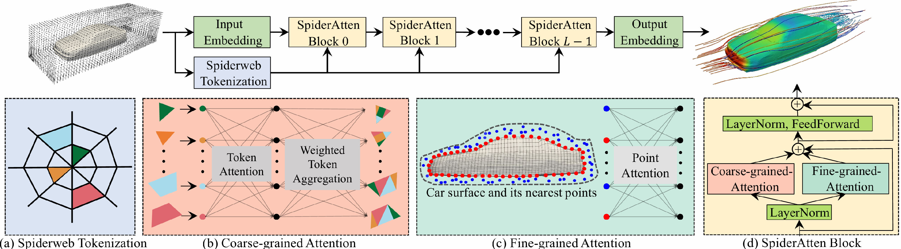
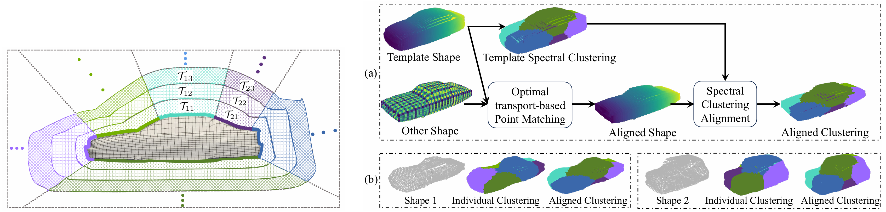

# SpiderSolver
SpiderSolver: A Geometry-Aware Transformer for Solving PDEs on Complex Geometries


# SpiderSolver: A Geometry-Aware Transformer for Solving PDEs on Complex Geometries，NeurIPS 2025.

##  🧾 1.  Abstract

 Transformers have demonstrated effectiveness in solving partial differential equa
tions (PDEs). However, extending them to solve PDEs on complex geometries
 remains a challenge. In this work, we propose SpiderSolver, a geometry-aware
 transformer that introduces spiderweb tokenization for handling complex domain
 geometry and irregularly discretized points. Our method partitions the irregular
 spatial domain into spiderweb-like patches, guided by the domain boundary ge
ometry. SpiderSolver leverages a coarse-grained attention mechanism to capture
 global interactions across spiderweb tokens and a fine-grained attention mechanism
 to refine feature interactions between the domain boundary and its neighboring
 interior points. We evaluate SpiderSolver on PDEs with diverse domain geometries
 across five datasets, including cars, airfoils, blood flow in the human thoracic aorta,
 as well as canonical cases governed by the Navier-Stokes and Darcy flow equations.
 Experimental results demonstrate that SpiderSolver consistently achieves state-of-the-art performance across different datasets and metrics, with better generalization
 ability in the OOD setting.


## 🧠 2.  Architecture

The two figures respectively illustrate: the model’s overall architecture; the spiderweb-like subregion structure from spiderweb tokenization and the optimal transport–based alignment used for spectral clustering.






##  🏋️‍♂️ 4.  Training on the Infant-PWMl-CP Dataset

### 🔧 Training


### 🧪 Evaluation


---


## 🚀 5.  


## 🛠️ 6. Requirements
The required Python packages for each code implementation are listed in their respective `requirements.txt` files.


## 📚 7. Citation
If using our Infant-PWMl-CP dataset or find this work useful in your research, please cite our paper:

```
@inproceedings{qi2025SpiderSolver,
  title     = {SpiderSolver: A Geometry-Aware Transformer for Solving PDEs on Complex Geometries},
  author    = {Kai Qi, Fan Wang, Zhewen Dong and Jian Sun},
  booktitle   = {NeurIPS},
  year      = {2025}
}
```


## 🙏 8. Acknowledgement

We would like to acknowledge the contributions of the following works, which inspired and supported our research:

- Haixu Wu, Huakun Luo, et al. **Transolver: A fast transformer solver for pdes on general geometries**. *ICML*, 2024.
- Zongyi Li, Nikola Kovachki, et al. **Fourier neural operator for parametric partial differential equations**. *ICLR* 2021.


